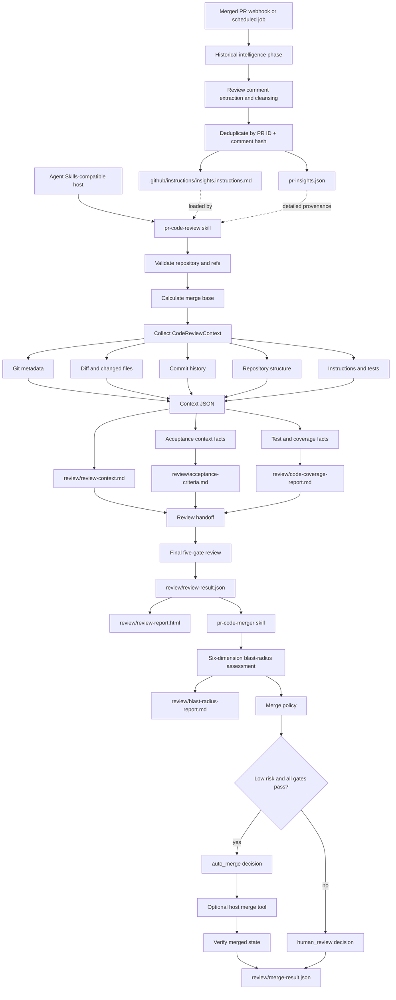

# Agent Skills Flow

The portable package surface is `plugin.json` plus the immediate skill directories under `skills/`. The Git-only collector produces review context; hosts decide how to expose skills and deliver merged-PR events.