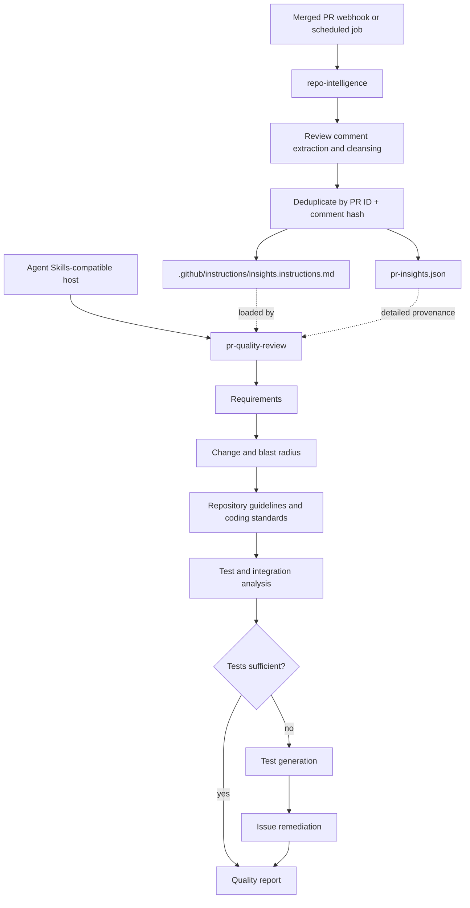

# Agent Skills Flow

The portable package surface is `plugin.json` plus the immediate skill directories under `skills/`. Hosts decide how skills are exposed and how merged-PR events invoke `repo-intelligence`.