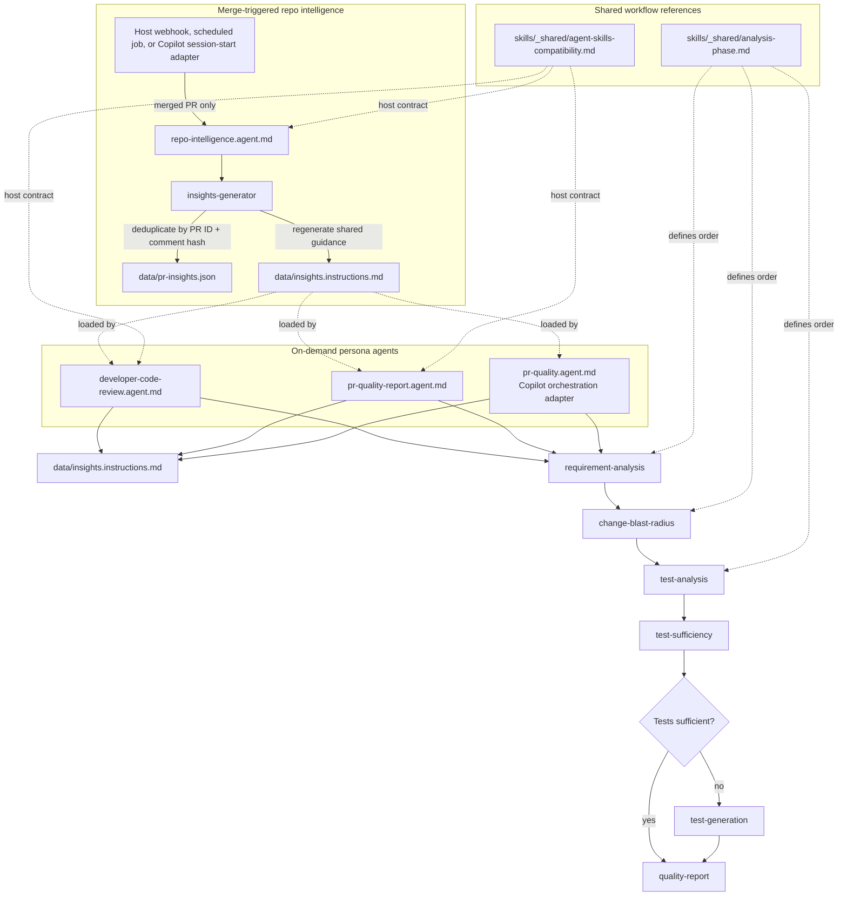

# Agent and Skill Flow

```mermaid
flowchart TD
    subgraph Personas[On-demand persona agents]
        D[developer-code-review.agent.md]
        R[pr-quality-report.agent.md]
        P[pr-quality.agent.md\nCopilot orchestration adapter]
    end

    I[data/insights.instructions.md]
    Q[requirement-analysis]
    B[change-blast-radius]
    T[test-analysis]
    S[test-sufficiency]
    G{Tests sufficient?}
    TG[test-generation]
    QR[quality-report]

    D --> I
    R --> I
    P --> I
    D --> Q
    R --> Q
    P --> Q
    Q --> B --> T --> S --> G
    G -->|yes| QR
    G -->|no| TG --> QR

    subgraph Intelligence[Merge-triggered repo intelligence]
        H[Host webhook, scheduled job, or Copilot session-start adapter]
        RI[repo-intelligence.agent.md]
        IG[insights-generator]
        JSON[data/pr-insights.json]
        INST[data/insights.instructions.md]
    end

    H -->|merged PR only| RI --> IG
    IG -->|deduplicate by PR ID + comment hash| JSON
    IG -->|regenerate shared guidance| INST
    INST -. loaded by .-> D
    INST -. loaded by .-> R
    INST -. loaded by .-> P

    subgraph Shared[Shared workflow references]
        AP[skills/_shared/analysis-phase.md]
        AC[skills/_shared/agent-skills-compatibility.md]
    end

    AP -. defines order .-> Q
    AP -. defines order .-> B
    AP -. defines order .-> T
    AC -. host contract .-> D
    AC -. host contract .-> R
    AC -. host contract .-> RI
```

The `skills/` directories and `AGENTS.md` are the portable Agent Skills integration surface. `plugin.json`, `agents/*.agent.md`, and `hooks.json` are optional host adapters.